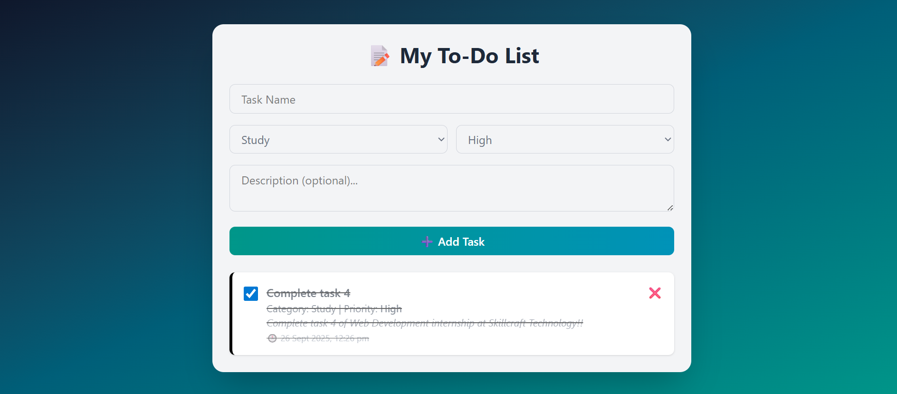

# 📝 To-Do List App

A responsive and interactive **To-Do List Application** built with **HTML, Tailwind CSS, and JavaScript**.

---

## 🚀 Features
- ➕ Add tasks with **name, category, priority, and description**
- ✅ Mark tasks as complete (checkbox)
- ❌ Delete tasks easily
- 📌 Categories: Work, Study, Personal
- ⚡ Priorities with color coding:
  - Green → Low
  - Yellow → Medium
  - Red → High
- 💾 Tasks are stored in **sessionStorage** (persist until browser is closed)
- 📱 Responsive and modern UI using **Tailwind CSS**

---

## 🛠️ Tech Stack
- **HTML5**
- **Tailwind CSS**
- **JavaScript (Vanilla JS)**

---

## 📂 Project Structure
- `index.html` → Main structure
- `output.css` → Tailwind CSS styles
- `script.js` → JavaScript logic for adding, deleting, saving tasks

---

## 📸 Screenshots

---

## 🔗 Live Demo
[GitHub Live preview](https://devansh-soni1.github.io/SCT_WD_4/src/)

---

## 📬 Connect With Me
- GitHub: [Devansh-Soni1](https://github.com/Devansh-Soni1)  
- LinkedIn: [Devansh-soni1](https://www.linkedin.com/in/Devansh-soni1/)  
